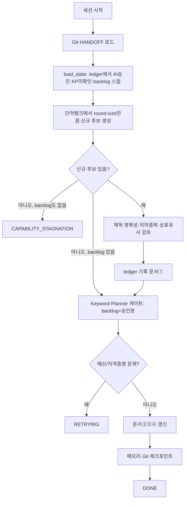

# 워크플로우·상태·영속 메모리

**목적:** 세션이 끊겨도 마지막 검증 배치부터 재개하고 토큰 낭비 없이 필요한 지식만 읽도록 한다.

## Claude Code 실행 지침
1. 표준 상태 외 임의 상태를 추가하지 않는다.
2. 세션 한계는 DONE이 아니라 PAUSED로 저장한다.
3. HANDOFF는 현재 상태와 다음 작업만 짧게 유지한다.
4. 재발 가능성·손상 위험·점수 오류·회귀 실패 등 의미 있는 문제만 개별 이슈로 기록한다.
5. 측정 가능한 개선과 QA가 없는 방법은 validated 플레이북 규칙으로 승격하지 않는다.

## 원본 설계 세부 규칙

> 원본 설계서의 §11(워크플로우) mermaid 다이어그램과 §13 읽기 순서는 수요/공급
> 파이프라인(2026-08-18 완전 삭제)과 "정확히 500/20개" 계약(같은 날 폐기) 기준으로
> 그려져 있었다. 원본은 `git log`(커밋 `d1ca668` 이후)로 확인 가능하며, 아래는
> 현재(2026-08-18 이후) 실제 실행되는 워크플로우로 교체했다. **(2026-08-19 추가
> 정정, 전체 문서 감사에서 발견)** 이 교체 작업이 §11·§13은 갈아엎었지만
> §14(이슈와 노하우)는 손대지 않아 수요/공급 특화 항목(공급 과소·과대 추정,
> 수요 탐지 정확도 등)이 남아있었다 — 이번에 §14도 함께 현재 파이프라인 기준으로
> 교체한다. 또한 이번 배치가 `memory/ACTIVITY_LOG.jsonl`(2026-08-10 이후 0바이트,
> 한 번도 안 쓰임)과 `memory/issues/`·`memory/lessons/`(둘 다 `.gitkeep`뿐인 빈
> 디렉토리)를 실제로 삭제해서, 아래 §13(구 12.1~12.3)의 관련 문구도 실제 관행에
> 맞게 고쳤다.

# 11. 워크플로우와 상태 전이

표준 상태:

`RUNNING`, `RETRYING`, `CAPABILITY_STAGNATION`, `COMMIT_PENDING`, `RECOVERY_REQUIRED`, `PAUSED`, `FAILED`, `DONE`.

세션 한계는 `DONE`이 아니다. 현재 배치를 검증하고 인수인계·커밋·푸시 후 `PAUSED`로 저장한다.

---

# 13. 영속 메모리와 토큰 절약

## 12.1 세션 시작 읽기 순서

1. `CLAUDE.md`
2. `KNOWLEDGE_MANIFEST.yaml`
3. `HANDOFF.md`
4. `PROJECT_PLAYBOOK.md`
5. `ACTIVE_ISSUES.md`
6. 현재 Run 상태(`output/_pipeline/runs/<run_id>/run_state.json`)
7. `output/deliverables/history/generated_candidates.csv`/`keyword_metrics_passed.csv` 최근 상태

과거 실행 이력이 필요하면 `git log`와 `memory/ACTIVE_ISSUES.md`에서 검색한다
(`memory/ACTIVITY_LOG.jsonl`은 2026-08-10 도입 이후 실제로 쓰인 적이 없어
2026-08-19에 삭제했다).

**(2026-09-15 추가, 사용자 지시 — 이슈 아카이브 분리)** `ACTIVE_ISSUES.md`는
OPEN 이슈 전문만 유지하고, RESOLVED·역사적 이슈의 전문은
`memory/archive/ACTIVE_ISSUES_ARCHIVE.md`로 무변경 이동했다. 아카이브는 세션
시작 읽기 순서에 없으며, 요약으로 부족할 때 해당 섹션만 찾아 읽는다. 이슈가
해결되면 전문을 아카이브에 append하고 본 파일의 요약 인덱스를 갱신한다 —
세션 시작 토큰 사용량을 일정하게 유지하기 위한 구조다.
`WORD_GENERATION_LEARNINGS.md`는 학습 루프(핵심 원칙 코드 주입, 라운드별 로그
축적)의 원본 보존이 우선이라 아카이브 분리 대상에서 제외했다(사용자 확인).

## 12.2 간소화 원칙

- `HANDOFF.md`는 현재 상태와 다음 작업만 짧게 유지
- 모든 정상 라운드를 장문 이슈로 만들지 않음
- 반복 가능성이 있는 오류만 `memory/ACTIVE_ISSUES.md`에 기록(2026-08-19까지는
  전용 디렉토리 `/memory/issues/`를 따로 뒀지만 한 번도 안 쓰여 삭제 — 실제
  운영은 항상 이 한 파일로 통합돼 있었다)
- 측정 가능한 개선이 확인된 규칙만 `memory/PROJECT_PLAYBOOK.md`(일반 원칙)
  또는 `memory/WORD_GENERATION_LEARNINGS.md`(단어 생성 특화, candidate/validated
  구분)에 반영(마찬가지로 전용 디렉토리 `/memory/lessons/`는 안 쓰여 삭제)
- 원문 전체를 프롬프트에 넣지 않음
- 승인율 하위 조합과 거절된 제목을 반복 재검토하지 않음(ledger가 재생성을 막음)

## 12.3 원자 작업 단위

토큰과 Git 커밋 수를 줄이기 위해 다음을 하나의 원자 작업으로 본다(현재
파이프라인 `word_pipeline.py`의 3단계와 1:1 대응).

- `load_state`: ledger에서 AI승인·KP미확인 backlog 스윕
- 단어뱅크 소진 시 `expand_word_bank` 판정 1회
- `generate_and_review_titles`: round-size 신규 후보 생성 + 제목 검토(review_titles)
- Keyword Planner 게이트 적용(backlog + 이번 승인분)
- `update_memory_and_git_checkpoint`: 메모리·Git 체크포인트(라운드당 1커밋)
- QA 배치(round-size만 작게, 그 외 동일 경로)

배치 내부의 개별 파일 읽기나 데이터 한 행 처리는 별도 에이전트 호출이나 별도 커밋으로 만들지 않는다.

---

# 14. 이슈와 노하우

## 13.1 이슈 기록

다음 상황만 개별 이슈로 기록한다(`memory/ACTIVE_ISSUES.md`).

- 같은 오류가 재발할 가능성이 있음
- 데이터 손상 또는 누락 위험(ledger/캐시 병합 오류 포함)
- Keyword Planner 게이트 판정 오류
- Keyword Planner API 접근성 변경(자격증명·일일 예산 등)
- 세션 재개 실패
- Git 충돌 또는 푸시 실패
- QA 회귀 실패
- `round_history.csv` 정체 점검이 `stagnant`/`declining`을 반복 판정

이슈 문서 필수 내용:

증상, 영향, 오류 시그니처, 시도, 실패 이유, 근본 원인, 최종 해결, 검증, 재발 방지, 수정 파일, 관련 커밋.

새 이슈 발생 시 과거 이슈를 먼저 검색한다.

## 13.2 노하우 기록

다음 조건을 모두 만족하는 경우에만 플레이북/`WORD_GENERATION_LEARNINGS.md`에
반영한다.

- 이전 방식과 비교됨
- Keyword Planner 통과율, 은퇴 기능어 발생률, ledger 승인율 중 하나 이상 개선
- 다른 핵심 지표를 악화시키지 않음
- 독립 검토 또는 QA 통과
- 적용 조건과 금지 조건이 명확함(`WORD_GENERATION_LEARNINGS.md`의 경우 교란
  변수 없이 독립적으로 확인됐는지까지 포함)

한 번 성공한 방법은 `candidate`이며, 검증 후에만 `validated`로 승격한다.

---
